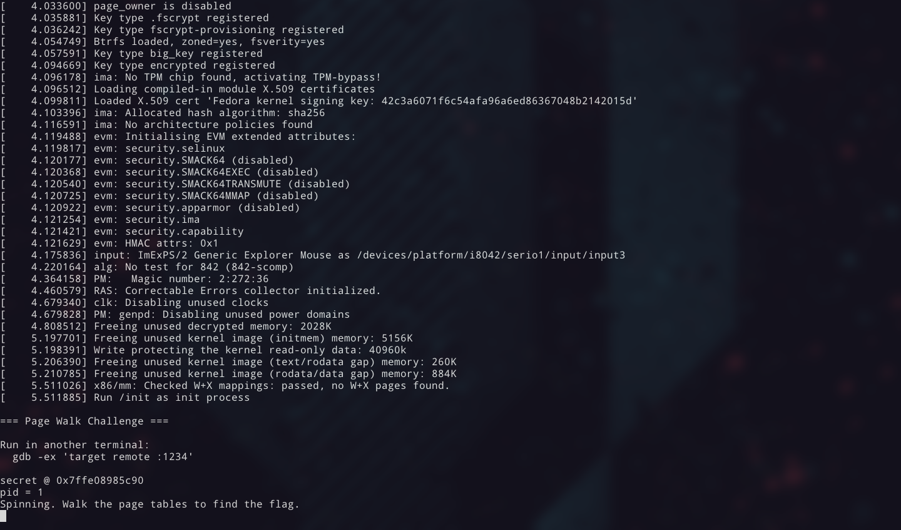
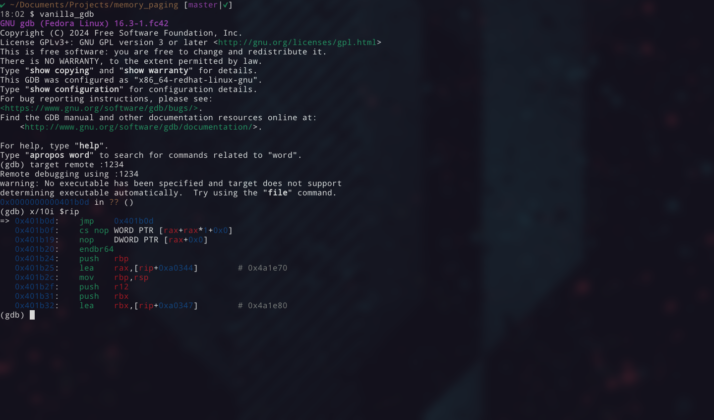
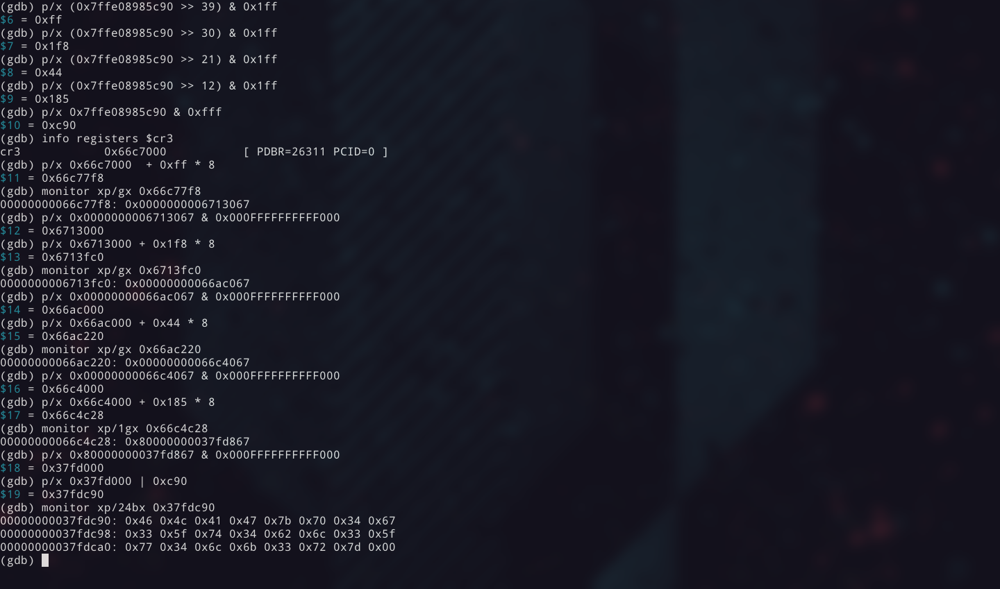
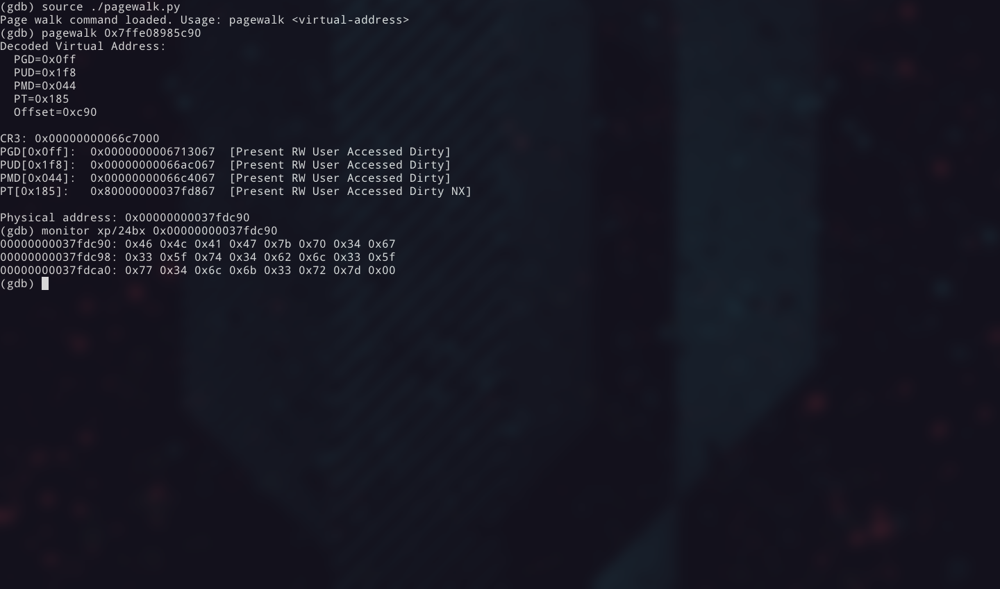

# Capture the Flag in Physical Memory

You've read about paging. The diagrams make sense. Four levels, 9 bits each,
page frame, offset. Sure. But then you hit a
[challenge](https://pwn.college/system-security/kernel-security/) that
requires actually walking page tables, and you realize you don't _know_ it.
You know _about_ it. Big difference.

What worked for me was sitting in front of QEMU and gdb and doing the
walk myself: computing every index, reading every entry from physical memory,
following every pointer by hand. One afternoon of that could teach more than
hours of lectures.

This is a collection of my notes from that process. If you're still missing
the conceptual side, watch Zardus's
[lecture on kernel memory management](https://youtu.be/SygLhZUTmKQ?si=ewpraVetvBemItpQ)
first. That's the theory. This is the lab.

The goal: take a virtual address and chase it through raw physical memory
until we find the data. No kernel helpers. No abstractions. Just a QEMU VM,
gdb, and raw physical memory.

By the end, paging won't be something you read about, it'll be something you
know because you did it by hand.

---

## Setting up the lab

I ran this on Fedora 42 with kernel `6.18.13-100.fc42.x86_64`. Any recent
Linux distro should work. Adjust the package names for your package manager.
A pre-built kernel is included in `kernel/vmlinuz`, so you don't need to
supply your own.

You need QEMU and gdb:

```
sudo dnf install qemu-system-x86 gdb
```

### The challenge binary

The target is a trivial C program that stores a flag in memory and prints its
virtual address:

```c
#include <stdio.h>
#include <unistd.h>

int main(void)
{
    char secret[] = "FLAG{p4g3_t4bl3_w4lk3r}";

    printf("secret @ %p\n", (void *)secret);
    printf("pid = %d\n", getpid());
    printf("Spinning. Walk the page tables to find the flag.\n");

    while (1)
    {
    }
}
```

The busy loop is intentional. I originally used `pause()`, but that puts the
process to sleep in a syscall: when gdb halts the VM, the CPU is likely
running the idle task with a different CR3. A spinning loop keeps the process
on-CPU, so halting guarantees you're in its context with the right page tables.

A pre-built initramfs with this binary is already included in
`initramfs.cpio.gz`. If you need to rebuild it (Linux only, requires
busybox and glibc-static), run `make` in this directory.

### Launching QEMU

```
./start.sh
```

The script boots the bundled kernel and initramfs under QEMU with `-s`
(gdb server on `localhost:1234`) and `nokaslr` so kernel addresses stay
fixed between runs.

The VM boots immediately and the challenge binary runs. You'll see the flag's
virtual address printed to the console.

```
secret @ 0x7ffe08985c90
pid = 1
Spinning. Walk the page tables to find the flag.
```

Write down that virtual address. That's your target.



> The default QEMU escape key is `Ctrl-a`, but that collides with my tmux
> prefix, so the script uses `-echr 0x11` to remap it to `Ctrl-q`. If you
> use `Ctrl-q` for something else, change the hex value in `start.sh` to
> suit your setup.

### Attaching gdb

In a second terminal:

```
gdb -ex "target remote :1234"
```



---

## Decomposing the virtual address

You have a virtual address. But where's the data, _really_?

Virtual addresses are the operating system's polite fiction. Every process
thinks it has its own private memory starting from zero. In reality, the data
lives at some completely unrelated location in physical RAM. The page table is
the map between the two: a tree structure that the CPU walks on every single
memory access (or looks up from its TLB cache).

So let's do what the CPU does. Manually. To translate that address, we need to
decompose it into the indices the CPU uses at each level.

An x86-64 virtual address is 48 bits wide. Those 48 bits are split into five
fields:

```
 63    48 47    39 38    30 29    21 20    12 11       0
┌────────┬────────┬────────┬────────┬────────┬──────────┐
│ sign   │  PGD   │  PUD   │  PMD   │   PT   │  Offset  │
│ extend │ index  │ index  │ index  │ index  │          │
│ (16b)  │ (9b)   │ (9b)   │ (9b)   │ (9b)   │  (12b)   │
└────────┴────────┴────────┴────────┴────────┴──────────┘
```

Each 9-bit index selects one of 512 entries in a page table at that level. The
12-bit offset selects a byte within the final 4 KB (0x1000) page.

To extract the indices, shift and mask:

```
PGD index  = (VA >> 39) & 0x1FF
PUD index  = (VA >> 30) & 0x1FF
PMD index  = (VA >> 21) & 0x1FF
PT  index  = (VA >> 12) & 0x1FF
Offset     =  VA        & 0xFFF
```

In gdb, you can compute these directly:

```
(gdb) p/x (0x7ffe08985c90 >> 39) & 0x1ff
$1 = 0xff
(gdb) p/x (0x7ffe08985c90 >> 30) & 0x1ff
$2 = 0x1f8
(gdb) p/x (0x7ffe08985c90 >> 21) & 0x1ff
$3 = 0x44
(gdb) p/x (0x7ffe08985c90 >> 12) & 0x1ff
$4 = 0x185
(gdb) p/x 0x7ffe08985c90 & 0xfff
$5 = 0xc90
```

Write these down. You'll use each one at its corresponding level.

> **Your values will differ.** The address `0x7ffe08985c90` is just an example.
> Use whatever address your challenge binary printed.

> **A note on 5-level paging.** Recent CPUs and kernels support LA57, which adds
> a fifth level (PML5) above the PGD and extends virtual addresses to 57 bits.
> The walk is the same pattern: one more 9-bit index, one more table lookup.
> Most systems still run 4-level paging. You can check yours:
> `cat /proc/cpuinfo | grep la57`. Everything in this article assumes 4-level.

---

## Finding CR3: the root of the tree

Every tree has a root. For page tables, that root is in the CR3 register: it
holds the physical address of the top-level table, the PGD.
Every process gets its own CR3 value, the kernel swaps it on context switch.

This is our entry point into the walk. Read it from gdb:

```
(gdb) info registers cr3
cr3            0x66c7000           [ PDBR=26311 PCID=0 ]
```

The page table base is `0x66c7000`. The low 12 bits are PCID/flags (zero here),
so the base address is the value as-is.

This is where the walk starts.

---

## The walk

Here's the trick: every level
follows the same pattern. The flags vary slightly between levels, but the
process doesn't. The pattern:

1. **Compute the entry address:** `base + index * 8` (each entry is 8 bytes)
2. **Read the entry from physical memory** using QEMU monitor's `xp` command
3. **Decode the flags** (see the reference below). If Present (bit 0) is 0, the page isn't mapped and the walk stops
4. **Extract the next table's base:** mask the entry with `& 0x000FFFFFFFFFF000`
5. **Move to the next level**

Every entry is 64 bits. The common flag bits:

```
Bit   Name              Meaning when set
 0    Present           Page/table is mapped
 1    Read/Write        Writable
 2    User/Supervisor   Accessible from userspace
 3    Write-Through     Write-through caching
 4    Cache Disable     Caching disabled
 5    Accessed          CPU has read this entry
 6    Dirty             CPU has written to the page (final level only)
 7    Page Size         1 GB page (PUD) or 2 MB page (PMD)
63    NX                No-execute
```

Bits [51:12] hold the physical address of the next table (or the page frame at
the final level). Bits 9-11 are ignored by hardware and available for OS use.
Linux uses them for bookkeeping (soft-dirty tracking, for example). Bits 52-62
are reserved. You'll encounter both when reading PTEs in exploit writeups.

Keep this flag table handy as you walk.

Let's go.

### Level 4: PGD (Page Global Directory)

We have the PGD base from CR3: `0x66c7000`.
Our PGD index is `0xff`.

Compute the entry address:

```
entry = 0x66c7000 + 0xff * 8 = 0x66c77f8
```

Read it from gdb using QEMU's physical memory examine command:

```
(gdb) monitor xp/1gx 0x66c77f8
000000066c77f8: 0x0000000006713067
```

Entry: `0x6713067` [Present RW User Accessed Dirty]. Next base: `0x6713067 & 0x000FFFFFFFFFF000` = `0x6713000`.

### Level 3: PUD (Page Upper Directory)

The base we extracted from the PGD entry (`0x6713000`) points to the PUD. Same
process, next index: `0x1f8`.

```
entry = 0x6713000 + 0x1f8 * 8 = 0x6713fc0
```

```
(gdb) monitor xp/1gx 0x6713fc0
00000006713fc0: 0x00000000066ac067
```

Entry: `0x66ac067` [Present RW User Accessed Dirty]. Page Size (bit 7) = 0, not a 1 GB huge
page. Next base: `0x66ac067 & 0x000FFFFFFFFFF000` = `0x66ac000`.

### Level 2: PMD (Page Middle Directory)

Base: `0x66ac000`. PMD index: `0x44`.

```
entry = 0x66ac000 + 0x44 * 8 = 0x66ac220
```

```
(gdb) monitor xp/1gx 0x66ac220
000000066ac220: 0x00000000066c4067
```

Entry: `0x66c4067` [Present RW User Accessed Dirty]. Page Size (bit 7) = 0, not a 2 MB huge
page. Next base: `0x66c4067 & 0x000FFFFFFFFFF000` = `0x66c4000`.

### Level 1: PT (Page Table)

Base: `0x66c4000`. PT index: `0x185`.

```
entry = 0x66c4000 + 0x185 * 8 = 0x66c4c28
```

```
(gdb) monitor xp/1gx 0x66c4c28
000000066c4c28: 0x80000000037fd867
```

Entry: `0x80000000037fd867` [Present RW User Accessed Dirty NX]. This is the
final PTE. Physical page frame: `0x80000000037fd867 & 0x000FFFFFFFFFF000` =
`0x37fd000`.

### What if Present = 0?

Let's see what happens when the walk hits an unmapped page. Pick an address
that's almost certainly not mapped, something in the middle of the address
space:

```
(gdb) p/x (0x0000414141414000 >> 39) & 0x1ff
$1 = 0x82
```

```
(gdb) monitor xp/1gx 0x66c7000 + 0x82 * 8
00000000066c7410: 0x0000000000000000
```

All zeros. Bit 0 (Present) is clear. The walk stops here. There's no PUD, no
PMD, no PT, no page frame. This address doesn't map to physical memory.

If the CPU hit this during normal execution, it would raise a **page fault**
(interrupt 14). The kernel's fault handler would then decide what to do: load
the page from disk (swap), allocate a new page (demand paging), or kill the
process with a segfault.

The point: the page table isn't just a translation structure. It's also the
mechanism that makes virtual memory _virtual_. Not every address needs to have
physical memory behind it. The CPU discovers this during the walk, one level at
a time.

---

## The reveal

Combine the physical page frame with the offset from the original virtual
address:

```
Physical address = 0x37fd000 | 0xc90 = 0x37fdc90
```

Now read it:

```
(gdb) monitor xp/6bx 0x37fdc90
00000000037fdc90: 0x46 0x4c 0x41 0x47 0x7b 0x70
```

That's `F`, `L`, `A`, `G`, `{`, `p`: the start of our flag. Read more:

```
(gdb) monitor xp/24bx 0x37fdc90
00000000037fdc90: 0x46 0x4c 0x41 0x47 0x7b 0x70 0x34 0x67
00000000037fdc98: 0x33 0x5f 0x74 0x34 0x62 0x6c 0x33 0x5f
00000000037fdca0: 0x77 0x34 0x6c 0x6b 0x33 0x72 0x7d 0x00
```

```
FLAG{p4g3_t4bl3_w4lk3r}
```



There it is. You just did what the CPU does billions of times per second,
but you did it by hand, reading raw bytes from physical memory. Four tables
deep, nothing hidden behind an abstraction.

Before, paging was a diagram in a slide deck. Now it's
a sequence of reads you can replay in your head: base, index, shift, mask, follow.
That difference matters when you're staring at a kernel exploit and need to
reason about what a write to a PTE actually does.

You can verify your result with QEMU's `gva2gpa` (guest virtual address to
guest physical address) monitor command, which does the walk internally:

```
(qemu) gva2gpa 0x7ffe08985c90
gpa: 0x37fdc90
```

---

## Flags and permissions

We decoded flags at every level during the walk but skipped over what they
mean for security. Look at the final PTE:

```
0x80000000037fd867
```

```
Bit  0 (Present)        = 1    Page is in physical memory
Bit  1 (Read/Write)     = 1    Page is writable
Bit  2 (User/Supervisor)= 1    Accessible from user mode
Bit  3 (Write-Through)  = 0    Write-back caching
Bit  4 (Cache Disable)  = 0    Caching enabled
Bit  5 (Accessed)       = 1    CPU has read this page
Bit  6 (Dirty)          = 1    CPU has written to this page
Bit  7 (Page Size)      = 0    4 KB page (not huge)
Bit 63 (NX)             = 1    No-Execute: cannot run code from this page
```

This makes sense: the secret is a stack variable. The stack is readable,
writable, and dirty (it's been written to). It's marked no-execute because
modern systems enforce W^X: a page that's writable shouldn't be executable.

The flags at each level are ANDed together by the hardware. If the PUD entry
has User=0, nothing below it is user-accessible, regardless of what the PTE
says. The most restrictive permission wins.

---

## The TLB: when the CPU skips the walk

Four memory reads just to access one byte. That's expensive. The CPU doesn't
actually walk the page table on every memory access. It caches the result in a
**Translation Lookaside Buffer (TLB)**.

After the first access to our flag's virtual address, the CPU stores the mapping
`0x7ffe08985c90 -> 0x37fdc90` (roughly) in the TLB. Subsequent accesses hit the
cache and skip the walk entirely. The page table sits untouched in RAM.

This is transparent to normal code. But it matters the moment you _modify_ a
page table entry. If you write a new physical address into a PTE, the CPU
doesn't notice: the TLB still holds the old mapping. You have to explicitly
flush it.

The kernel does this with the `invlpg` instruction, which invalidates the TLB
entry for a single virtual address. Call `mprotect` from userspace and that's
what happens under the hood: the kernel updates the PTE flags, then flushes the
TLB so the CPU picks up the new permissions.

This has direct security implications. In a kernel exploit, if you manage to
write to a PTE (say, clearing the NX bit to make the stack executable), you
also need the TLB to be flushed before the CPU will honor the change. Sometimes
the kernel does this for you as a side effect of the code path you triggered.
Sometimes you need to arrange it yourself. Either way, you need to know the
TLB exists, or your exploit works in theory but not in practice.

---

## Huge pages: when the walk ends early

In the walkthrough above, we went through all four levels. But the walk can
end early if a Page Size bit (bit 7) is set.

**At Level 3 (PUD):** If bit 7 is set, the entry maps a 1 GB page directly.
The physical address is taken from the entry, and bits [29:0] of the virtual
address become the offset (30 bits = 1 GB).

**At Level 2 (PMD):** If bit 7 is set, the entry maps a 2 MB page. Bits
[20:0] of the virtual address become the offset (21 bits = 2 MB).

You'll often see huge pages in kernel mappings. The kernel's direct-map region
(`0xffff888000000000` on most 64-bit kernels) frequently uses 2 MB or 1 GB
pages to reduce TLB pressure.

If you encounter a huge page during your walk, the formula changes:

```
2 MB page:  phys = (PMD_entry & 0x000FFFFFFFE00000) | (VA & 0x1FFFFF)
1 GB page:  phys = (PUD_entry & 0x000FFFFFC0000000) | (VA & 0x3FFFFFFF)
```

---

## Automating the walk

Now that we know the process, let's encode it. `pagewalk.py` is a
gdb Python script that does the same walk we just did. The core logic fits in
one function:

```python
ADDR_MASK = 0x000FFFFFFFFFF000

def read_phys(addr):
    """Read a 64-bit value from guest physical memory via QEMU monitor."""
    result = gdb.execute(f"monitor xp/1gx {addr:#x}", to_string=True)
    return int(result.strip().split(":")[1].strip(), 16)

def pagewalk(va):
    cr3 = int(gdb.parse_and_eval("$cr3"))
    pgd_base = cr3 & ADDR_MASK

    # Decompose the virtual address
    pgd_idx = (va >> 39) & 0x1FF
    pud_idx = (va >> 30) & 0x1FF
    pmd_idx = (va >> 21) & 0x1FF
    pt_idx  = (va >> 12) & 0x1FF
    offset  =  va        & 0xFFF

    # Walk: each level is the same pattern
    pgd_entry = read_phys(pgd_base + pgd_idx * 8)
    if not (pgd_entry & 1): return None       # Not present
    pud_base = pgd_entry & ADDR_MASK

    pud_entry = read_phys(pud_base + pud_idx * 8)
    if not (pud_entry & 1): return None
    if pud_entry & (1 << 7):                   # 1 GB huge page
        return (pud_entry & 0x000FFFFFC0000000) | (va & 0x3FFFFFFF)
    pmd_base = pud_entry & ADDR_MASK

    pmd_entry = read_phys(pmd_base + pmd_idx * 8)
    if not (pmd_entry & 1): return None
    if pmd_entry & (1 << 7):                   # 2 MB huge page
        return (pmd_entry & 0x000FFFFFFFE00000) | (va & 0x1FFFFF)
    pt_base = pmd_entry & ADDR_MASK

    pt_entry = read_phys(pt_base + pt_idx * 8)
    if not (pt_entry & 1): return None

    return (pt_entry & ADDR_MASK) | offset
```

The full script (with flag decoding and pretty output) is in `pagewalk.py`.
Source it and use it to verify your manual work, or to explore other addresses:

```
(gdb) source ./pagewalk.py
Page walk command loaded. Usage: pagewalk <virtual-address>
(gdb) pagewalk 0x7ffe08985c90
Decoded Virtual Address:
  PGD=0x0ff
  PUD=0x1f8
  PMD=0x044
  PT=0x185
  Offset=0xc90

CR3: 0x00000000066c7000
PGD[0x0ff]:  0x0000000006713067  [Present RW User Accessed Dirty]
PUD[0x1f8]:  0x00000000066ac067  [Present RW User Accessed Dirty]
PMD[0x044]:  0x00000000066c4067  [Present RW User Accessed Dirty]
PT[0x185]:   0x80000000037fd867  [Present RW User Accessed Dirty NX]

Physical address: 0x00000000037fdc90
```



Notice how the script checks for huge pages at the PUD and PMD levels before
continuing the walk. That's the same logic we discussed in the huge pages
section: if PageSize (bit 7) is set, the walk ends early and the offset is
wider.

Try walking the address of a function: you'll see the NX bit is clear (code
must be executable). Try a read-only data section: you'll see R/W is clear.

---

## Reading physical memory without QEMU

Throughout this exercise we used `monitor xp` to read physical memory directly.
That works because QEMU's monitor sits outside the VM and can access the
guest's physical address space. In a real exploit, you don't have that luxury.

The kernel solves this for itself with the **direct-map region**: a contiguous
virtual mapping of _all_ physical RAM. On x86-64, this region conventionally
starts at `0xffff888000000000`, but with KASLR enabled the base is randomized.
The kernel stores the actual base in a symbol called `page_offset_base`.

We booted with `nokaslr`, so the base is at its default. Let's confirm:

```
(gdb) x/s 0xffff888000000000 + 0x37fdc90
0xffff888037fdc90: "FLAG{p4g3_t4bl3_w4lk3r}"
```

Same physical memory, accessed through a kernel virtual address. This is how the
kernel itself reads arbitrary physical memory: `phys_to_virt()` is just
`page_offset_base + phys_addr`.

This is also why kernel exploits care about leaking `page_offset_base`. If KASLR
is enabled, you don't know where the direct map starts, so you can't convert
physical addresses to kernel virtual addresses. Leak the base, and you can
read or write any physical address through the direct map, including page table
entries themselves.

---

## Finding another process's page tables

We got lucky with CR3: our challenge binary was the running process when gdb
halted the VM. But what if you need to walk the page tables of a _different_
process?

Every process's CR3 value is stored in its `task_struct`. The path is:

```
task_struct -> mm_struct -> pgd -> physical page
```

In gdb with kernel symbols, you can find init's task_struct (PID 1) and extract
its page table root:

```
(gdb) p/x init_task.mm->pgd
$1 = 0xffff8880066c7000
```

That's a kernel virtual address in the direct map. Strip the base to get the
physical address:

```
0xffff8880066c7000 - 0xffff888000000000 = 0x66c7000
```

That's the same CR3 we started with, which makes sense: our challenge binary
_is_ PID 1 in this minimal initramfs.

For other processes, you'd walk the task list (`init_task.tasks` linked list),
find the target, and extract its `mm->pgd` the same way. Each process has its
own page table tree rooted at its own CR3. The kernel swaps CR3 on every context
switch, giving each process the illusion of private memory.

---

## What this means

If you've gotten this far by actually doing the walk (not just reading) you
now have something that no amount of diagrams can give you: intuition for how
memory actually works at the hardware level. Here's where that intuition pays
off:

**ASLR randomizes the virtual address, not the walk.** The structure of the
page table is always the same: four levels, 512 entries each, same bit layout.
ASLR changes which indices you'll compute, but the process is identical.

**W^X is enforced in the page table.** The R/W bit and NX bit in the PTE are
what make `mprotect` work. When an exploit tries to execute shellcode on the
stack, the CPU checks the NX bit during translation and faults.

**SMEP and SMAP check the User bit.** Supervisor Mode Execution/Access
Prevention checks the User/Supervisor bit across all levels of the page table.
If any entry marks the address as user-mode and kernel code tries to
execute or access it, the CPU faults. This is why modern kernel
exploits can't just jump to userspace shellcode.

**Kernel exploits often target page tables directly.** If you can write to a
PTE, you can change what physical memory a virtual address maps to, change
permissions, or remap kernel memory as user-accessible. Understanding the walk
is understanding the attack surface.

**KPTI splits the page table in two.** Instead of one set of page tables per
process, there are now two: one for user mode (with almost all kernel pages
unmapped) and one for kernel mode (with everything). The kernel swaps CR3 on
every syscall entry and exit. You can observe this: halt the VM while in
userspace and read CR3, then set a breakpoint on a syscall entry and read CR3
again. They'll differ. The user-mode page table simply doesn't contain entries
for kernel memory, so there's nothing to leak even if the walk completes.

The next time a kernel exploit write-up mentions "remapping page tables", it
won't be abstract. You'll know exactly which bytes they're talking about,
because you've read them yourself.

---

## Further reading

- [Understanding Paging](https://blog.zolutal.io/understanding-paging/):
  the tutorial that inspired this one. This article tries to push the
  exploration a bit further, but start there if you haven't
- [Intel SDM, Volume 3A, Chapter 4: "Paging"](https://www.intel.com/content/www/us/en/developer/articles/technical/intel-sdm.html):
  the authoritative reference (surprisingly readable once you've done a walk by
  hand)
- [pwn.college](https://pwn.college/system-security/kernel-security/): the
  challenges that made me actually learn this stuff, highly recommended
